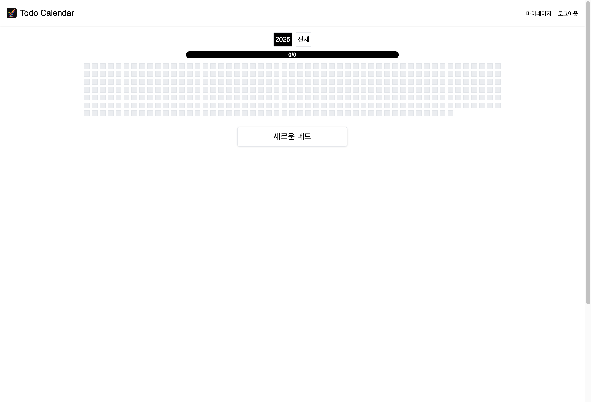
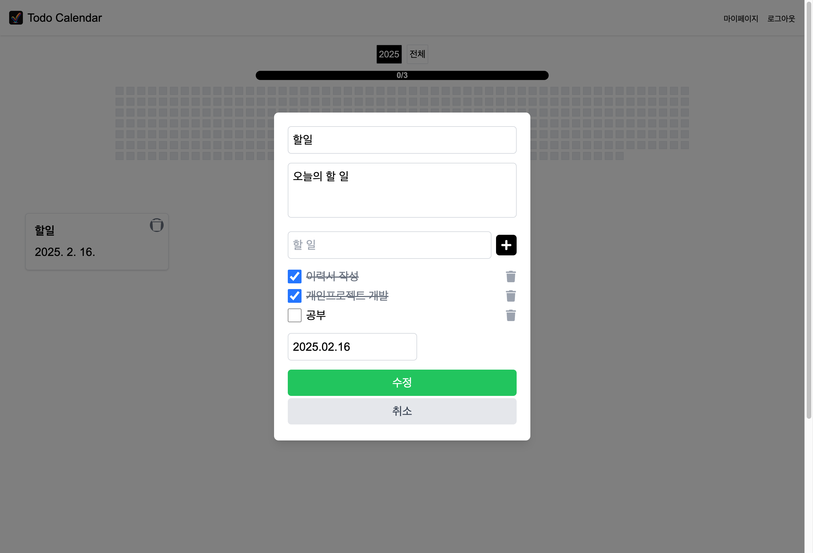
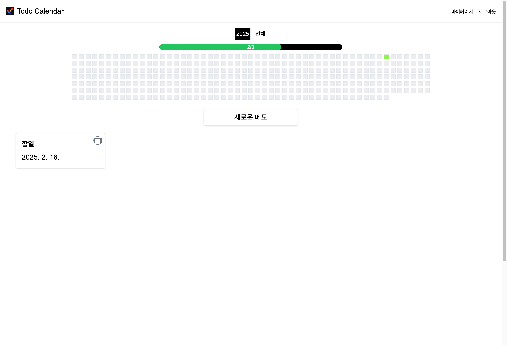
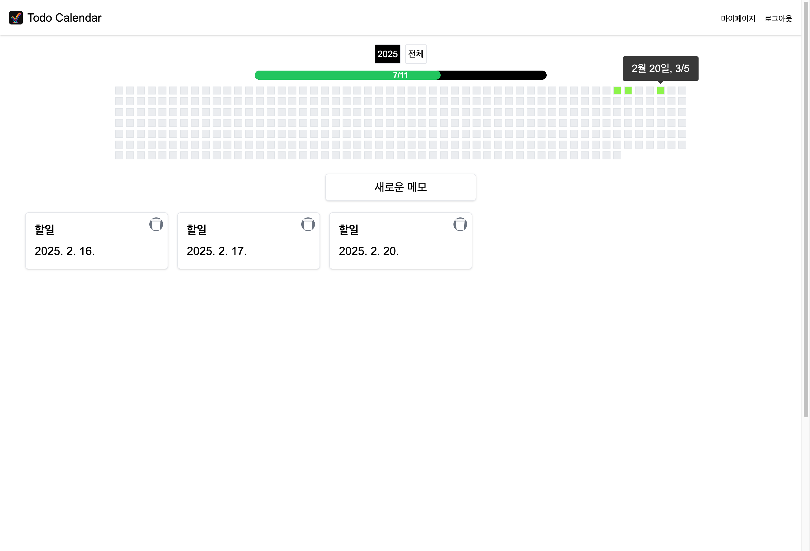
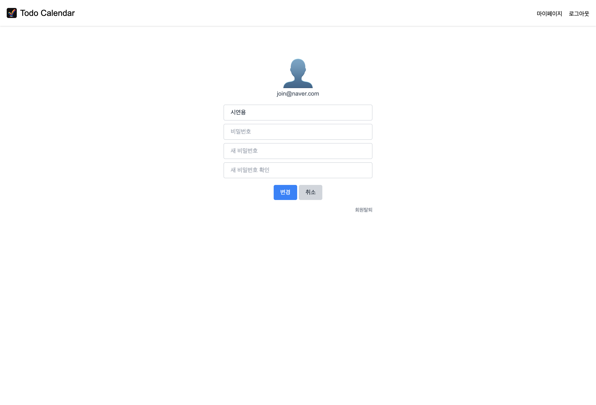

# Todo Calendar Frontend

Todo Calendar는 사용자의 일정을 관리하고 추적할 수 있는 웹 애플리케이션입니다.

## 주요 기능

### 1. 사용자 인증

#### 로그인

- 이메일과 비밀번호를 통한 로그인
- (이메일 코드 전송 등의 인증로직은 구현하지 않음)

#### 회원가입

- 이메일, 비밀번호, 이름 입력 폼

### 2. 일정 관리

#### 메인 캘린더 화면

- 연간 진행률 표시
- 일정 목록 캘린더 화면
- 새로운 일정 추가 버튼

#### 일정 추가

- 일정 제목 입력
- 일정 설명 입력
- 날짜 선택 (2025.02.16)
- 카테고리 선택
  - 이력서 작성
  - 개인 프로젝트 개발
  - 공부
- 추가/취소 버튼

#### 일정 추가 후 메인화면 변화

- 상단 프로그레스 바로 전체 진행률 시각화
- 연도별 진행 상황 확인 가능
- 일정 완료율 즉시 반영
- 작성한 일정 수정/삭제 가능

### 3. 회원 수정/탈퇴

