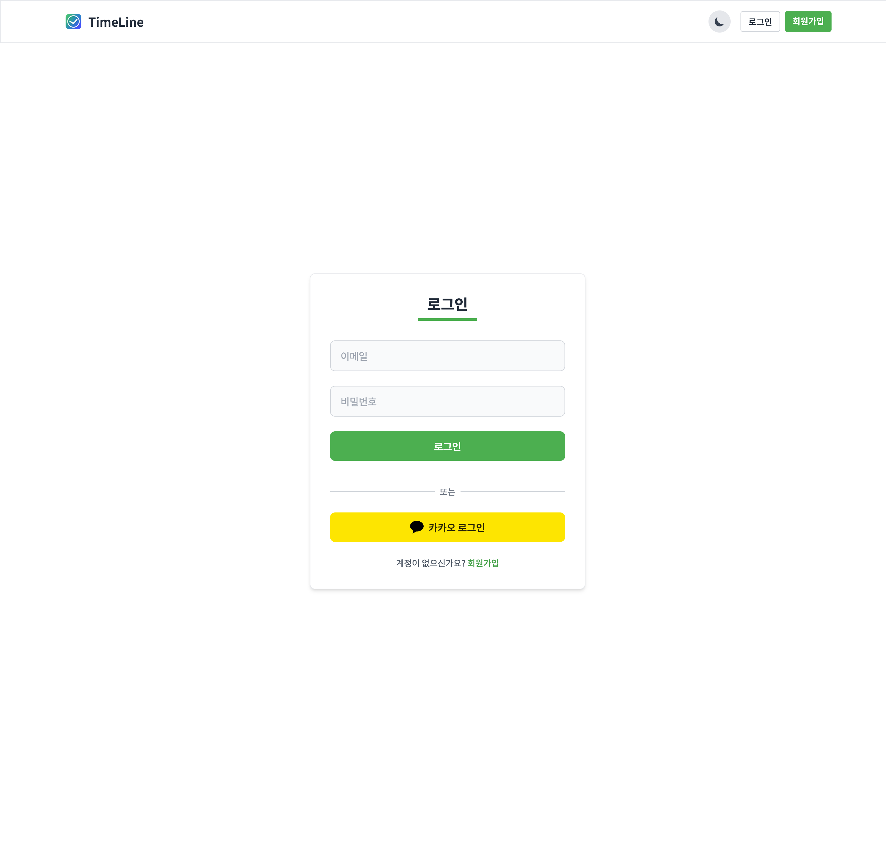
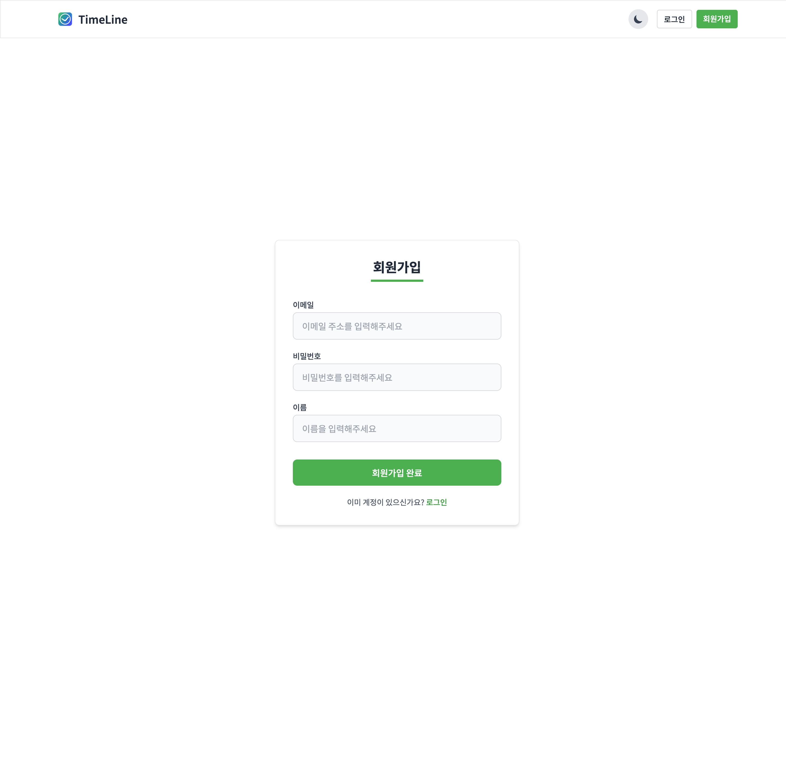

# Todo Calendar Frontend

Todo Calendar는 사용자의 일정을 관리하고 추적할 수 있는 웹 애플리케이션입니다.

### https://www.dailytodocalendar.com

## 프론트엔드 기술 스택

### 핵심 기술

- **React 18**: 최신 React 버전을 사용한 사용자 인터페이스 구축
- **TypeScript**: 정적 타입 지원으로 개발 안정성 강화
- **React Router v6**: SPA 라우팅 관리
- **Tailwind CSS**: 유틸리티 우선 CSS 프레임워크로 빠른 UI 개발

### 상태 관리 및 데이터 통신

- **Context API**: 테마 및 상태 관리 (ThemeContext 등)
- **Axios**: REST API 통신 클라이언트
- **Custom Hooks**: 재사용 가능한 로직 관리

### 인증 및 보안

- **JWT 인증**: 토큰 기반 사용자 인증
- **JS-Cookie**: 쿠키 관리 라이브러리

### 사용자 경험

- **다크 모드**: 테마 컨텍스트를 통한 다크/라이트 모드 전환

### 품질 관리

- **ESLint & TypeScript**: 코드 품질 및 일관성 확보

## 주요 기능

### 1. 사용자 인증

#### 로그인

- 이메일과 비밀번호를 통한 로그인
- 카카오 아이디를 통한 로그인

#### 회원가입

- 이메일, 비밀번호, 이름 입력 폼

### 2. 일정 관리

#### 메인 캘린더 화면

- 연간/월간/일간 진행률 표시
- 일정 목록 캘린더 화면
- 새로운 일정 추가 버튼

#### 일정 추가

- 일정 제목 입력
- 일정 설명 입력
- 날짜 선택 (2025.02.16)
- 할일 목록 설정
- 추가/취소 버튼

#### 일정 추가 후 메인화면 변화

- 상단 프로그레스 바로 전체 진행률 시각화
- 연도별 진행 상황 확인 가능
- 일정 완료율 즉시 반영
- 작성한 일정 수정/삭제 가능

### 3. 회원 수정/탈퇴

